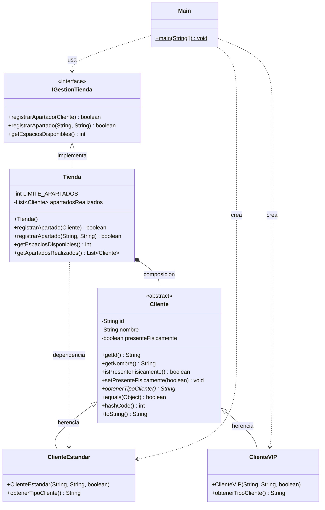

# Sistema de Gestión de Apartados — Portafolio POO
 
**Universidad CENFOTEC · SOFT-04 Programación Orientada a Objetos · Periodo 2026-C1**
 
Portafolio de evidencias sobre los principios y relaciones fundamentales de la Programación Orientada a Objetos, implementado en Java con un sistema de gestión de apartados para una tienda.
 
---
 
## Descripción del Problema
 
Se seleccionó un sistema de gestión de apartados para una tienda como problema central. Este contexto permite modelar de forma natural las relaciones entre entidades del mundo real:
 
- Una tienda puede registrar apartados para múltiples clientes.
- Cada cliente tiene un tipo específico (Estándar o VIP).
- El sistema controla cuántos apartados se pueden registrar (límite de 50).
- Los clientes deben estar físicamente presentes para registrar un apartado.
---
 
## Arquitectura del Proyecto
 
El proyecto está organizado en tres capas siguiendo el principio de separación de responsabilidades:
 
```
src/
├── modelo/               <- Capa de Modelo (entidades del dominio)
│   ├── Cliente.java
│   ├── ClienteEstandar.java
│   └── ClienteVIP.java
├── logica/               <- Capa de Lógica de Negocio
│   ├── IGestionTienda.java
│   └── Tienda.java
└── ui/                   <- Capa de Interfaz de Usuario
    └── Main.java
```
 
| Capa | Paquete | Responsabilidad |
|------|---------|-----------------|
| Modelo | `modelo` | Entidades del dominio, sin lógica de negocio |
| Lógica | `logica` | Reglas de negocio y gestión de apartados |
| UI | `ui` | Punto de entrada e interacción con el usuario |
 
---
 
## Diagrama UML de Clases
 

 
---
 
## Conceptos POO Implementados
 
### Abstracción
 
`Cliente` es una clase abstracta que define la estructura general de un cliente sin especificar el tipo concreto. El método `obtenerTipoCliente()` es abstracto y obliga a cada subclase a definir su propio tipo.
 
```java
public abstract class Cliente {
    public abstract String obtenerTipoCliente(); // cada subclase lo define
}
```
 
`IGestionTienda` también aplica abstracción: define qué operaciones debe ofrecer cualquier tienda, sin determinar cómo se implementan.
 
---
 
### Encapsulamiento
 
Todos los atributos de `Cliente` son `private` y se acceden únicamente mediante métodos controlados.
 
```java
private String id;
private String nombre;
private boolean presenteFisicamente;
 
public String getId()   { return id; }
public String getNombre() { return nombre; }
public void setPresenteFisicamente(boolean v) { this.presenteFisicamente = v; }
```
 
En `Tienda`, la lista interna se protege retornando una copia:
 
```java
public List<Cliente> getApartadosRealizados() {
    return new ArrayList<>(apartadosRealizados); // copia defensiva
}
```
 
---
 
### Modularidad
 
Cada clase tiene una única responsabilidad. El código está dividido en paquetes por capa, lo que facilita el mantenimiento y la reutilización.
 
---
 
### Herencia
 
`ClienteEstandar` y `ClienteVIP` extienden `Cliente`, heredando sus atributos y métodos, y cada una sobreescribe `obtenerTipoCliente()`.
 
```java
public class ClienteEstandar extends Cliente {
    @Override
    public String obtenerTipoCliente() { return "Estándar"; }
}
 
public class ClienteVIP extends Cliente {
    @Override
    public String obtenerTipoCliente() { return "VIP"; }
}
```
 
---
 
### Polimorfismo
 
En `Main`, las variables son de tipo `Cliente` pero apuntan a instancias concretas. El método `obtenerTipoCliente()` se resuelve en tiempo de ejecución.
 
```java
Cliente c1 = new ClienteEstandar("E001", "Ana López", true);
Cliente c2 = new ClienteVIP("V001", "Carlos Mora", true);
 
c1.obtenerTipoCliente(); // retorna "Estándar"
c2.obtenerTipoCliente(); // retorna "VIP"
```
 
---
 
### Sobrecarga de Métodos
 
`Tienda` ofrece dos versiones de `registrarApartado`: una recibe un objeto `Cliente` y otra recibe `String` directamente.
 
```java
boolean registrarApartado(Cliente cliente)           // recibe objeto
boolean registrarApartado(String id, String nombre)  // recibe datos básicos
```
 
---
 
### Sobreescritura de Métodos
 
Las subclases sobreescriben `obtenerTipoCliente()` con `@Override`. Además, `Cliente` sobreescribe `equals()`, `hashCode()` y `toString()` de `Object`.
 
---
 
### Identidad de Objetos — equals y hashCode
 
Dos clientes son iguales si tienen el mismo `id`, sin importar que sean instancias distintas en memoria.
 
```java
@Override
public boolean equals(Object obj) {
    if (this == obj) return true;
    if (!(obj instanceof Cliente)) return false;
    Cliente otro = (Cliente) obj;
    return this.id.equals(otro.id);
}
 
@Override
public int hashCode() { return id.hashCode(); }
```
 
---
 
### Relaciones entre Clases
 
| Relación | Clases | Descripción |
|----------|--------|-------------|
| Herencia | `ClienteEstandar` / `ClienteVIP` → `Cliente` | Las subclases heredan atributos y métodos |
| Realización | `Tienda` → `IGestionTienda` | Tienda cumple el contrato de la interfaz |
| Composición | `Tienda` → `List<Cliente>` | La lista vive y muere con la Tienda |
| Asociación | `Tienda` → `Cliente` | Tienda trabaja con clientes externos |
| Dependencia | `Tienda` → `ClienteEstandar` | Uso puntual dentro de `registrarApartado(String, String)` |
 
---
 
### Arquitectura por Capas
 
La capa UI depende únicamente de la interfaz `IGestionTienda`, no de la clase concreta `Tienda`. Esto permite cambiar la implementación sin modificar el código cliente.
 
```java
// Se programa hacia la interfaz, no hacia la implementación concreta
IGestionTienda tienda = new Tienda();
```
 
---
 
### JavaDoc
 
Todas las clases, interfaces y métodos incluyen documentación JavaDoc con `@author`, `@version`, `@param` y `@return`.
 
```java
/**
 * Registra un apartado para un cliente existente.
 *
 * @param cliente el cliente que solicita el apartado
 * @return {@code true} si el apartado fue registrado con éxito
 */
@Override
public boolean registrarApartado(Cliente cliente) { ... }
```
 
---
 
## Cómo Compilar y Ejecutar
 
**Requisitos:** Java 11 o superior.
 
```bash
# Compilar todos los archivos
javac -encoding UTF-8 -d out src/modelo/*.java src/logica/*.java src/ui/*.java
 
# Ejecutar
java -cp out ui.Main
```
 
**Salida esperada:**
 
```
=== Sistema de Apartados ===
Espacios disponibles: 50
 
Apartado registrado para: [Estándar] ID: E001 | Nombre: Ana López | Presente: Sí
Apartado registrado para: [VIP] ID: V001 | Nombre: Carlos Mora | Presente: Sí
El cliente Luis Pérez no se encuentra físicamente en la tienda.
 
Apartado registrado para: [Estándar] ID: E003 | Nombre: María Jiménez | Presente: Sí
 
Espacios restantes: 47
 
¿c1 equals copia? true
¿c1 equals c2?   false
```
 
---
 
## Conceptos Documentados (no implementados)
 
### Persistencia de Objetos
 
La persistencia permite que el estado de los objetos sobreviva más allá de la ejecución del programa. Se puede lograr mediante:
 
- **Patrón DAO:** define una interfaz (`IClienteDAO`) con operaciones CRUD y separa el acceso a datos del resto de la aplicación.
- **Almacenamiento en texto:** serialización de objetos en archivos `.txt` o `.csv` usando `FileWriter` y `BufferedReader`.
- **Almacenamiento en BD:** conexión a bases de datos relacionales mediante JDBC para ejecutar sentencias SQL.
### Interfaz Gráfica con JavaFX
 
JavaFX es el framework estándar de Java para interfaces gráficas. Sus conceptos clave son:
 
- **Stage:** ventana principal de la aplicación.
- **Scene:** contenedor de todos los nodos visuales.
- **FXML:** formato declarativo para describir la interfaz, separando diseño y lógica.
- **Controlador:** clase Java vinculada al FXML que maneja eventos del usuario.
- **Arquitectura MVC:** Vista (FXML) + Controlador (Java) + Modelo (clases de dominio).
---
 
## Estructura de Entrega
 
```
portafolio/
├── README.md
├── src/
│   ├── modelo/
│   │   ├── Cliente.java
│   │   ├── ClienteEstandar.java
│   │   └── ClienteVIP.java
│   ├── logica/
│   │   ├── IGestionTienda.java
│   │   └── Tienda.java
│   └── ui/
│       └── Main.java
└── Portafolio_POO_Final.docx
```
 
---
 
## Información del Curso
 
| Campo | Detalle |
|-------|---------|
| Universidad | CENFOTEC |
| Curso | SOFT-04 — Programación Orientada a Objetos |
| Periodo | 2026-C1 |
| Tipo de actividad | Portafolio individual |
| Valor | 10% — 48 puntos |
| Fecha de entrega | 14 de abril de 2026 |
